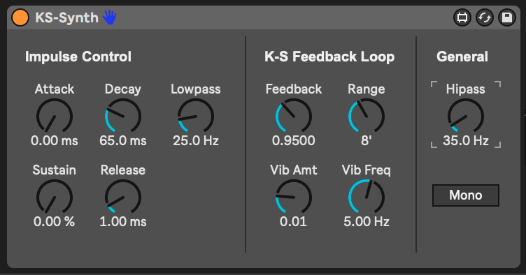

# m4l-KS-Synth

This is a Max For Live instrument that implements a 32 voice Karplus-Strong synthesizer.

The essence of Karplus-Strong synthesis is that a note-on triggers a sound impulse that is sent to a delay/feedback (echo) line. The note pitch controls the delay time, which is fast enough to be interpreted by our brains as a tone or pitch rather than distinct echoes.

## Installation / Setup

If you just want to download and install the device, then go to the [frozen/](https://github.com/zsteinkamp/m4l-KS-Synth/tree/main/frozen) directory and download the newest version there.

### Changelog

* [0.0.1](https://github.com/zsteinkamp/m4l-KS-Synth/raw/main/frozen/KS-Synth-0.0.1.amxd) - 2022-04-29 - Initial release.

## Usage

The KS-Synth has three main stages: the impulse, the feedback loop, and output.

### Impulse Stage

A note-on event triggers the impulse stage. It starts with white noise, which then passes through a low-pass filter, whose frequency you can control. The signal is then normalized and sent into an ADSR envelope to shape the impulse.

The impulse sound then goes into the delay feedback loop.

### K-S Feedback Loop

The Feedback amount is the main control over sound duration or release time.

The Range knob controls the base octave of the sound. By default, playing a middle-C note will play a middle-C tone.

There are also controls for Vibrato Amount and Frequency. These controls extend into fairly extreme values.

### Output / General

K-S synthesis produces a lot of very low frequency artifacts, so there is a high-pass filter on the output stage.

The Mono switch restricts the instrument to use only one voice. In Mono mode, pressing multiple notes will produce glitchy results, since the note-off events will affect the pitch of the currently playing tone. I considered fixing this, but I prefer this weird behavior. :)

## TODO

* Add a volume control for mixing in the raw impulse sound.
* Add a resonance control for the impulse LPF.
* Toggle for weird/normal Mono behavior.
* Portamento control.

## Contributing

I'd love it if others extended this device. If you would like to contribute, simply fork this repo, make your changes, and open a pull request and I'll have a look. Or if you have ideas or something to add to the to-do list above, just open an issue here or email me at [zack@steinkamp.us](mailto:zack@steinkamp.us).
